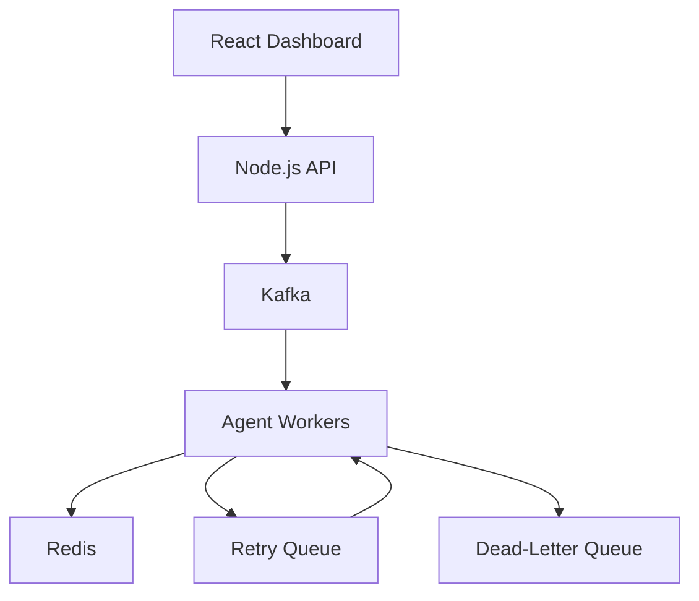

# AgentMesh

An agent orchestration platform built with Node.js, React, Kafka, Redis, and AWS.

## Overview

AgentMesh coordinates multi-step agent runs and provides a dashboard for inspecting execution progress and failures.

## Core Features

- Retry queues for failed jobs
- Idempotent job handling to prevent duplicate processing
- Dead-letter pipelines for jobs that exhaust retries
- A dashboard showing execution logs as a step-by-step run timeline

## Architecture

## Reliability Design

Retries handle transient failures. Idempotent processing prevents
repeated jobs from duplicating completed work. Jobs that exhaust
their retry limit move to a dead-letter queue for inspection.

## Project Status

Source code will be published in a future update.